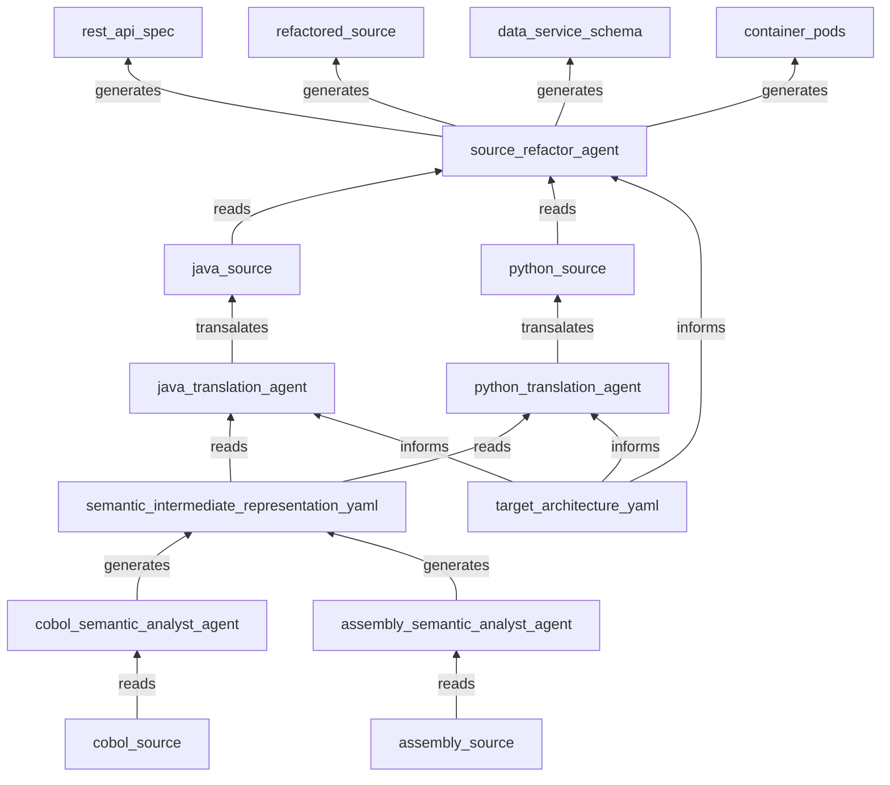

# ModernizationAI (modAI)


## Introduction

### Description

ModernizationAI (modAI) is an agentic generative AI solution designed to support the reengineering of legacy applications implemented in dead languages like COBOL and Assembly Language. The core components of modAI include semantic analysis agents, intermediate representation YAML, code translation agents, target architecture YAML, and application refactoring agents.

1. **Semantic Analysis Agents**: Specialized agents that read legacy code (COBOL, Assembly) and generate a semantic intermediate representation (SIR) in YAML format.
2. **Semantic Intermediate Representation YAML**: A language-independent, structured representation of the semantics of the analyzed legacy code.
3. **Code Translation Agents**: Agents that translate the SIR YAML into modern programming languages such as Java and Python.
4. **Target Architecture YAML**: Defines the target architecture for refactoring and deploying the code in a specified modernized target environment (cloud compute, storage, containers, etc.).
5. **Application Refactoring Agent**: Uses the target architecture YAML and translated code to draft refactorings that align with the target architecture blueprint, including creating REST APIs, cloud data services, and object-oriented file services.

### Architecture



### Inspiration

The transformative potential of generative AI technology and the urgent need to support the Federal Government and Financial Services organizations drive the creation of modAI. These entities face enormous technical debt due to mainframe computing running workloads with dead programming languages. The skills to maintain and develop these legacy platforms are rapidly vanishing, creating significant risks. modAI aims to help these organizations modernize their platforms, transitioning to cloud computing and reducing their reliance on outdated technologies.

### Problem Statement

Organizations running legacy systems in COBOL and Assembly face significant challenges in modernizing their technology stack. These challenges include:

- Lack of skilled developers familiar with legacy languages.
- High maintenance costs of outdated systems.
- Difficulty in integrating with modern cloud-based architectures.

modAI addresses these challenges by providing a comprehensive solution for analyzing, translating, and refactoring legacy code into modern, maintainable, and scalable architectures.

### Key Features

- **Automated Code Analysis**: Leverages AI to understand and document the semantics of legacy code.
- **Intermediate Representation**: Creates a machine-readable, structured requirements document that can be translated into multiple modern languages.
- **Code Translation**: Automatically generates code in modern programming languages such as Java and Python.
- **Target Architecture Definition**: Ensures the translated code aligns with modern architectural principles and cloud-native designs.
- **Application Refactoring**: Provides detailed refactoring recommendations and generates necessary artifacts for modern application deployment.

### License

```
MIT License

Copyright (c) 2024 [Your Name or Your Organization]

Permission is hereby granted, free of charge, to any person obtaining a copy
of this software and associated documentation files (the "Software"), to deal
in the Software without restriction, including without limitation the rights
to use, copy, modify, merge, publish, distribute, sublicense, and/or sell
copies of the Software, and to permit persons to whom the Software is
furnished to do so, subject to the following conditions:

The above copyright notice and this permission notice shall be included in all
copies or substantial portions of the Software.

THE SOFTWARE IS PROVIDED "AS IS", WITHOUT WARRANTY OF ANY KIND, EXPRESS OR
IMPLIED, INCLUDING BUT NOT LIMITED TO THE WARRANTIES OF MERCHANTABILITY,
FITNESS FOR A PARTICULAR PURPOSE AND NONINFRINGEMENT. IN NO EVENT SHALL THE
AUTHORS OR COPYRIGHT HOLDERS BE LIABLE FOR ANY CLAIM, DAMAGES OR OTHER
LIABILITY, WHETHER IN AN ACTION OF CONTRACT, TORT OR OTHERWISE, ARISING FROM,
OUT OF OR IN CONNECTION WITH THE SOFTWARE OR THE USE OR OTHER DEALINGS IN THE
SOFTWARE.
```

For more details, please refer to the [LICENSE](./LICENSE) file in the root of the repository.

### Acknowledgements

We would like to thank the following individuals and organizations for their contributions and support:

- **Sergio DuBois**: For founding the vision of this project.
- **[your_name_here]**: For their expertise and support in developing the core features.
- **Open Source Community**: For providing the tools and frameworks that made this project possible.
- **[Any other acknowledgements, such as institutions, mentors, or specific resources]**.

We are grateful for the support and collaboration that helps make modAI a successful and innovative solution for modernizing legacy applications.

---

### Installation (Placeholder)

1. **Prerequisites** (Placeholder)

   - Description of required software, hardware, and dependencies.

2. **Installation Steps** (Placeholder)
   - Step-by-step guide to installing modAI.

For now, we can keep these as placeholders with a note indicating that detailed instructions will be added as the project progresses.

---

### Usage

#### Basic Usage

1. **Running the Semantic Analysis Agent**

   - **Purpose**: To read legacy code and generate a semantic intermediate representation in YAML.
   - **Example**:
     ```sh
     python semantic_analysis_agent.py --input legacy_code.cobol --output intermediate_representation.yaml
     ```

2. **Generating Code with Translation Agents**

   - **Purpose**: To translate the intermediate representation YAML into a modern programming language.
   - **Example**:
     ```sh
     python code_translation_agent.py --input intermediate_representation.yaml --language java --output translated_code.java
     ```

3. **Defining Target Architecture**

   - **Purpose**: To create a target architecture YAML for guiding the refactoring process.
   - **Example**:
     ```yaml
     # target_architecture.yaml
     architecture:
       services:
         - name: user_service
           type: REST API
           endpoints:
             - /users
             - /users/{id}
       data_storage:
         type: cloud_database
         provider: AWS DynamoDB
     ```

4. **Running the Application Refactoring Agent**
   - **Purpose**: To refactor translated code based on the target architecture.
   - **Example**:
     ```sh
     python application_refactoring_agent.py --input translated_code.java --architecture target_architecture.yaml --output refactored_code.java
     ```

#### Advanced Usage

1. **Custom Configuration**

   - **Purpose**: To customize the behavior of agents for specific project needs.
   - **Example**:
     ```sh
     python semantic_analysis_agent.py --input legacy_code.asm --output intermediate_representation.yaml --config custom_config.json
     ```

2. **Batch Processing**

   - **Purpose**: To process multiple files or projects in a batch mode.
   - **Example**:
     ```sh
     python batch_processor.py --input_folder legacy_code_directory --output_folder intermediate_representations
     ```

3. **Integration with CI/CD Pipelines**
   - **Purpose**: To integrate modAI into continuous integration and deployment workflows.
   - **Example**:
     ```yaml
     # .github/workflows/ci.yml
     name: CI
     on: [push]
     jobs:
       build:
         runs-on: ubuntu-latest
         steps:
           - uses: actions/checkout@v2
           - name: Run Semantic Analysis
             run: python semantic_analysis_agent.py --input legacy_code.cobol --output intermediate_representation.yaml
           - name: Run Code Translation
             run: python code_translation_agent.py --input intermediate_representation.yaml --language python --output translated_code.py
           - name: Run Application Refactoring
             run: python application_refactoring_agent.py --input translated_code.py --architecture target_architecture.yaml --output refactored_code.py
     ```

#### Example Use Cases

1. **Modernizing a Legacy COBOL Application**

   - **Scenario**: A financial services firm wants to modernize a COBOL-based mainframe application.
   - **Workflow**:
     1. Use the semantic analysis agent to generate an intermediate representation of the COBOL code.
     2. Translate the intermediate representation to Java using the code translation agent.
     3. Define a target architecture for cloud deployment.
     4. Refactor the translated code to align with the target architecture.

2. **Migrating Assembly Language Code to Python**
   - **Scenario**: A government agency needs to migrate an Assembly Language application to Python for better maintainability.
   - **Workflow**:
     1. Generate the intermediate representation of the Assembly Language code.
     2. Use the code translation agent to convert the intermediate representation to Python.
     3. Define a target architecture suitable for modern cloud services.
     4. Refactor the translated Python code to fit the new architecture.

---

### Contributing

We welcome contributions to ModernizeAI (modAI)! Whether you're looking to report bugs, suggest new features, improve documentation, or contribute code, your input is invaluable to the success of this project.

#### How to Contribute

1. **Fork the Repository**

   - Start by forking the [modAI repository](#) to your GitHub account.

2. **Clone Your Fork**

   - Clone your forked repository to your local machine:
     ```sh
     git clone https://github.com/your-username/modAI.git
     cd modAI
     ```

3. **Create a Branch**

   - Create a new branch for your feature or bugfix:
     ```sh
     git checkout -b feature-or-bugfix-name
     ```

4. **Make Changes**

   - Implement your changes in the new branch. Ensure your code follows the project's coding standards and includes appropriate tests.

5. **Commit Your Changes**

   - Commit your changes with a descriptive commit message:
     ```sh
     git add .
     git commit -m "Description of your changes"
     ```

6. **Push to GitHub**

   - Push your changes to your forked repository:
     ```sh
     git push origin feature-or-bugfix-name
     ```

7. **Create a Pull Request**
   - Go to the original repository on GitHub and create a pull request. Provide a clear description of your changes and any related issue numbers.

#### Code of Conduct

We are committed to fostering a welcoming and inclusive community. By participating in this project, you agree to abide by our [Code of Conduct](#).

#### Reporting Issues

If you encounter any bugs or have suggestions for improvements, please [open an issue](#). Provide as much detail as possible to help us address the issue promptly.

#### Development Setup

1. **Install Dependencies**

   - Install the necessary dependencies for the project:
     ```sh
     pip install -r requirements.txt
     ```

2. **Run Tests**
   - Ensure all tests pass before submitting your pull request:
     ```sh
     pytest
     ```

---
